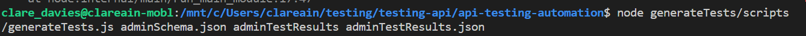
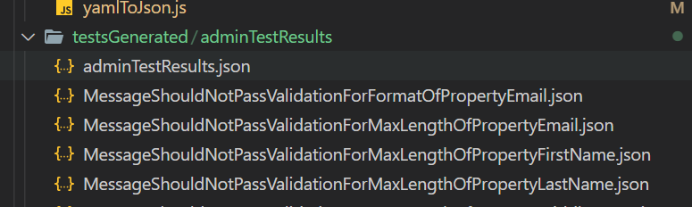
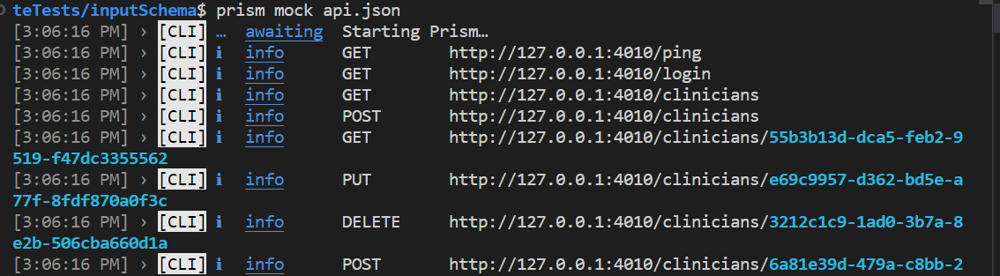
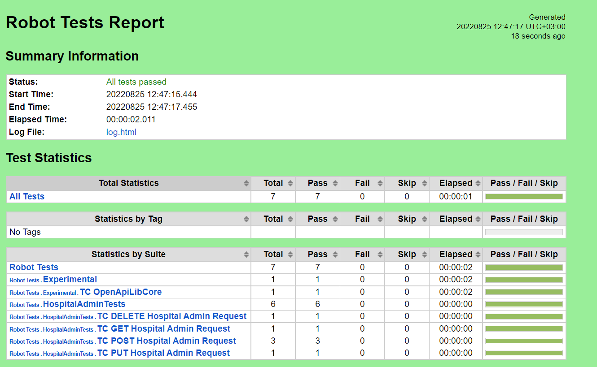

# README #


This project generates API test requests using json-schema-test-data-generator and then feeds the created test cases into the Robot Testing framework while using the Prisma mock server.

### What is Robot Framework? ###

Robot framework is a python based, open source test automation framework with great extensibility. Robot framework is cross platform and will run on Mac, Linux and Windows. 

See [here ](https://robotframework.org/)for Robot Framework home page

### How do I get set up Robot framework? ###

1) Install [Python 3](https://python.org/)
2) Clone or download this repository
3) Using the command line navigate in to the project folder and execute the command ```pip install -r requirements.txt``` this will install robot framework and the required supporting library's and their dependencies

### How do I get set up test generation? ###

The command to generate tests from a given schema is:
    $ node generateTests/scripts/generateTests.js 'inputSchemaFileName' 'wantedNameOfGeneratedTestResults' 'nameOfFileForTestResults'

    e.g. node generateTests/scripts/generateTests.js adminSchema.json adminTestResults adminTestResults.json



After the script has run, in the specified folder there will be an individual JSON file for each generated test case. The generated test files name is based of description message of the test.

Note - If you don't see the tests generated refresh the project.

 

### How do I get set up the Mock Server? ###
1) Install prism
    $npm install -g @stoplight/prism-cli

2) Mock your Open API specification using prism
    $prism mock generateTests/inputSchema/api.json 

 

### How do run the generated tests using robot framework with the mock server? ###
Once everything has been installed you can run the test suite from the command line in the projects folder with the command```robot robot_tests``` 

The output of the tests results will be stored as a report in the report.html file:

 
